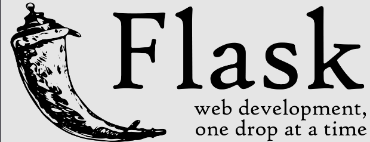
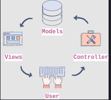
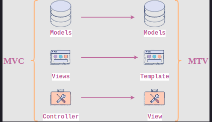

 

	

 

# 1. Introduction to Flask

Flask is <b>web development framwork</b> developed in Python.

### Features of Flask

1. Flask provides a development server and a debugger.
2. It uses Jinja2 templates
3. It is compliant with WSGI 1.0
4. It provides integrated support for unit testing.
5. Many extensions are available for Flask, which can be used to enhance its functionlities.

### What is a micro-framework?

Micro-framework are the opposite of full-stack frameworks, which also offer additiona modules for features such as authenitication, database ORM, input validation and sanitization, etc

## Who is Using Flask? 

### Netflix

Netflix uses many micro-services for different tools, such as its Winston and Bold products. These micro-services are developed usin Flask and Flask RESTPlus.

### Reddit

Reddit's technology stack includes Flask on the backend as well.

Source: [Stackshare](https://stackshare.io/reddit/reddit)

### Airbnb

Airbnb uses Flask for many of its projects such as [Airflow](https://airbnb.io/projects/airflow/)

### Lyft 

Lyfy uses Flask's signaling module to supply data to the web UI.

### Mozilla 

Mozilla has used Flask in many of their projects as well. specifically to utillize its easy CRUD support.

### Uber

Uber's [Marketplace](https://support-uber.com/) team has also used Flask to control optimization and balancing of dynamic pricing, supply positioning, intelligent matching, and health.

## The Client-Server Architectural Model

> 💡 The <code>client</code> and <code>server</code> are the main entities between which all communication of data over the Internet takes place.

### A real-world analogy

 

	
	 
	<code>Conversation between a client and a manager at a restaurant.</code>

  

 

	
	 
	<code>Conversation between a client and a waiter at a restaurant.</code>

 

> 💡 The <code>request</code> and <code>response</code> cycle is the core of all communication that takes place between a client and a server!

## Model-Template-View Architecture

#### 1. Models

Models represent how data is stored in the database. It contains all the data definitions for your application (the schema). For example, if you are creating a library management system, then a model for books will be present. It will define all the information concerning each book, such as the name of the author, number of copies, and so on.

#### 2. Views

Views are the components that are visible to the user, such as an output or a Graphical User Interface (GUI). In the case of a website, generally speaking, the views are the HTML pages.

#### 3. Controllers

Controllers are the components that act as an interface between models and views. The controller interprets the user interactions, or inputs, and performs tasks on models before returning the appropriate data through views. In the case of a point-of-sale application, at checkout, the controller will be responsible for calculating the total bill based on the product purchased, i.e., the model. Also, it will show you the total amount via a GUI, i.e., the view.

 

  
   
  <code>MVC Architecture</code>

 

### Model-template-view (MTV) architecture

The MTV architecture is a slight variation of MVC architecture. On its own, Flask is a microframework; it does not contain built-in support for any architectural framework. However, the programmers who use the Flask framework have adopted the MTV architecture because another Python-based web development framework, called <code>Django</code>, introduced it. A very rough comparison between MVC and MTV is given below.

 

	
	 
	<code>MVC to MTV</code>

 

## WSGI and Jinja2

### Web Server Gateway Interface (WSGI)

The <code>Web Server Gateway Interface</code>, or more commonly known as <code>WSGI</code>, is a standard that describes the specifications concerning the communication between a web server and a client application. The detail of these specifications is present in [PEP333](https://peps.python.org/pep-3333/). Here are some benefits of WSGI:

* <code>Flexibility</code> with the components of the application.

* <code>Interoperability</code> within different Python frameworks.

* <code>Scalability</code> of the application with an increase in users.

* <code>Efficiency</code> in terms of speed of development.

### The Jinja template languge

Jinja is a template language used in Python

